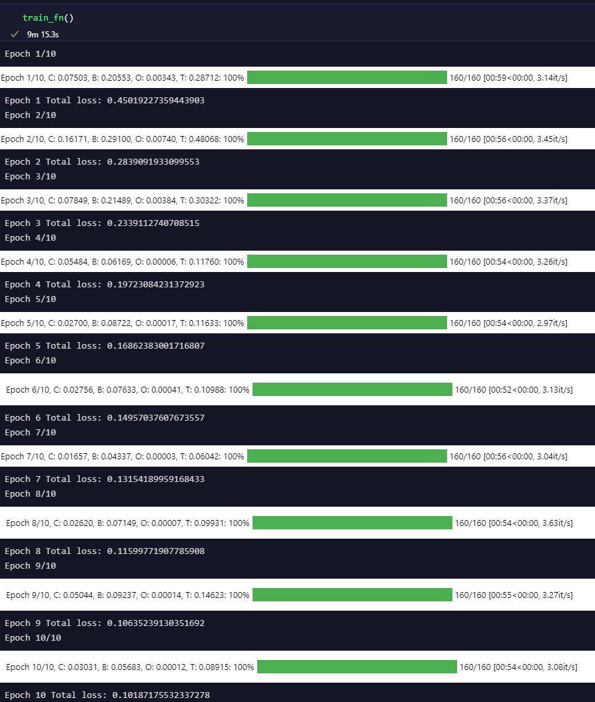

# Assignment 3

## TODO
- Fill all TODOs in the code
- Fill all the questions in the code
- Try to train your model yourself
- Think about what needs to be improved and write it in the report.

## Report
- Describe the overall code flow
- Description of the code you wrote
- Answers for the questions in the code
- Results

## Am I doing correct?
If your model trains like this, you are doing correct! 

